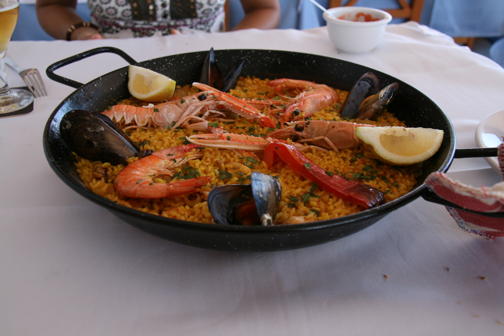

# Receta de Paella
La paella es un plato tradicial español, espcialmente de la región de Valencia. Es conocid por su rico saber y combinación de mariscos, carnes y vegetales. A continuación, te mostramos cómo prepararla

## Ingredientes

- Arróz (400g)
- Pollo (300g, troceado)
- Conejo (300g, troceado)
- Gambas ( 200g)
- Mejillones ( 200g)
- Calamares ( 200 gramos, en rodajas)
- Pimiento rojo (1, cortado en tiras)
- Judías verdes (150g)
- Tomate (2, rallados)
- Aceite de oliva (50 ml)
- Azafrán (unas hebras)
- Caldo de pollo o pescado (1 litro)
- Sal al gusto
- Pimienta al gusto

## Preparación

1. Calienta el aceite de oliva en una paella y sofríe la cebolla y el ajo hasta que estén dorados.
2. Añade el pimiento rojo y las judias verdes, cocinando hasta que estén tiernos.
3. Agrega los calamares y sofríe durante unos minutos, luego añade el tomete rallado y cocina hasta que se reduzca.
4. Incorpora el arroz y sofríe ligeramente. Añade las hebras de azafrán y mezcla bien.
5. vierte el caldo caliente y distribuye bien el arroz. Cocina a fuego alto durante 10 minutos 
6. COloa las gambas y mejillones sobre el arroz, reduce el fuego y cocina otros 10 minutos o hasta que el arroz esté en su punto.
7. Deja reposar la paella tapada durante 5 minutos antes de servir.

## Consejos

- Asegurate de no remover el arróz una vez añadido el caldo para lograr la textura perfecta
- Puedes añador otros mariscos como almejas o langostinos para darle más sabor.

  ¡Disfruta de tu paella casera!
  
  __Para más detalles sobre esta receta y sus variaciones, puedes visitar este
  [enlace](https://es.wikipedia.org/wiki/Paella.)__